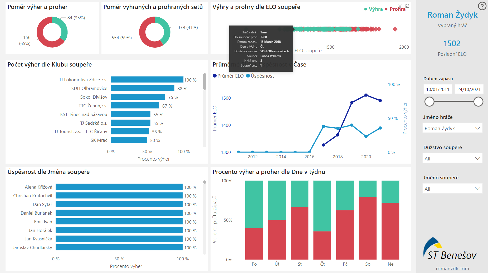

# Table tennis team players analysis

More of a PoC - some data about table tennis matches exists, therefore teams could try to utilize it as a strategy advantage to better plan matches. Also could be used as an inpiration for more advanced use cases - probably with additional (more granular) data sources, manual inputs, comments, trainings or other conditions.

Data: EloST.cz
Process: Scraped data from EloST.cz using BeautifulSoup, processed with pandas and visualized with Power BI.

Power BI report: https://app.powerbi.com/view?r=eyJrIjoiNWQ3ZDc4ZGQtZmZkMC00ZGE0LTk3ZDctNzk3ZDhmZTFiMjgzIiwidCI6IjJiNTFhNGIzLTQ0M2YtNDQwNi04Y2E0LTE5MDU2YTc5YTQ0NCIsImMiOjh9&pageName=ReportSection739acd1cdd965e3bd797

